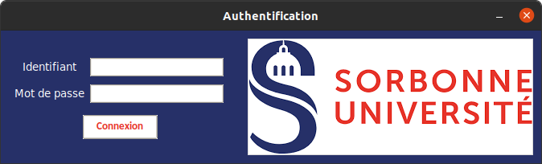
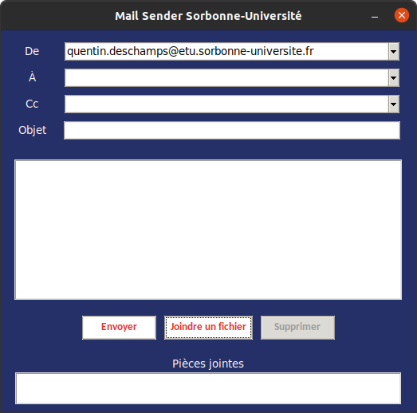
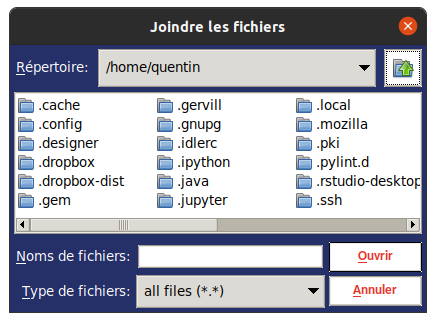
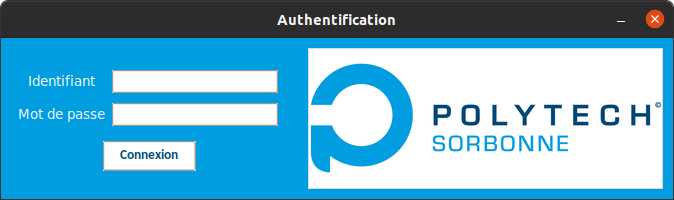

GUI
===
Pour utiliser la GUI, utilisez la commande :

.. code-block:: bash

   mailSenderSU gui

La fenêtre suivante doit apparaître :

Authentification
----------------
Entrez votre numéro étudiant et votre mot de passe pour vous connecter au serveur.
Si la connexion est établie, vous êtes dirigés sur la fenêtre suivante.

Votre adresse
-------------
* Dans le premier champ, vous devez utiliser votre adresse *sorbonne-universite.fr* ou *upmc.fr*. Une adresse externe à l'université ne fonctionnera pas.

Destinataires
-------------
* Dans le deuxième champ, vous devez mettre les adresses des destinataires.
* Dans le troisième champ, se sont les destinataires en copie.

.. note:: Veuillez séparer les adresses par **des virgules** s'il y en a plusieurs.

Pièces jointes
--------------
Pour insérer des pièces jointes, pressez le bouton *Joindre un fichier*.
La fenêtre suivante doit apparaître :

Sélectionner le(s) fichier(s) à insérer. Il apparaîtront dans le cadre du bas.
Vous pouvez supprimer une pièce jointe en cliquant sur celle-ci et en pressant le bouton *Supprimer*.

.. note:: Tout type de fichier peut être envoyé, même les archives *.zip* ou *.tar.gz*.

Envoyer
-------
Cliquez sur le bouton *Envoyer* pour lancer l'envoi. Un message vous indiquera
si l'envoi a réussi ou échoué. On vous proposera aussi d'ajouter les destinataires
à vos contacts si ceux-ci n'y sont pas.

Option style
------------
Avec l'option ``--style``, vous pouvez choisir le style de la fenêtre entre ``su`` ou ``polytech`` :

.. code-block:: bash

   mailSenderSU gui --style polytech

Voici le résultat de la commande ci-dessus :

